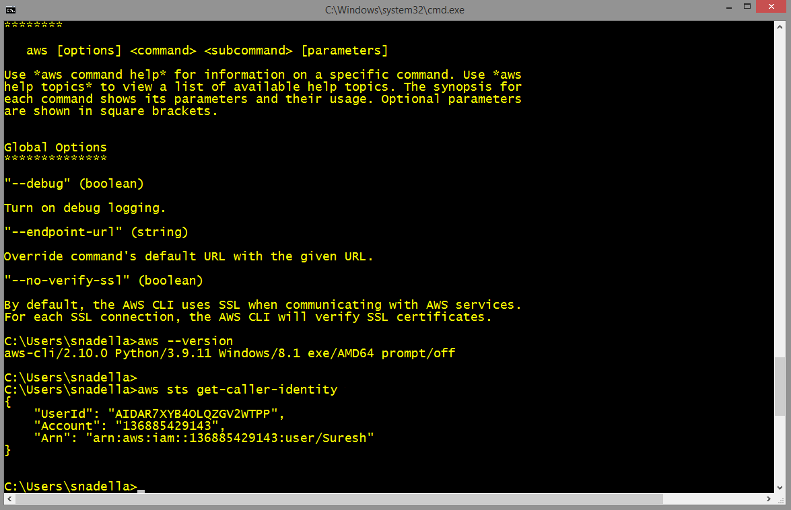

# Week 0 — Billing and Architecture
## Required homework
### Installed AWS CLI on local windows PC through windows installer
### I am showing the proof that its installed

I attempted running the aws commands after configuring my credentials



```
C:\Users\snadella>aws --version
aws-cli/2.10.0 Python/3.9.11 Windows/8.1 exe/AMD64 prompt/off

C:\Users\snadella>
C:\Users\snadella>aws sts get-caller-identity
{
    "UserId": "AIDAR7XYB4OLQZGV2WTPP",
    "Account": "136885429143",
    "Arn": "arn:aws:iam::136885429143:user/Suresh"
}

```

### Create a Billing alarm
