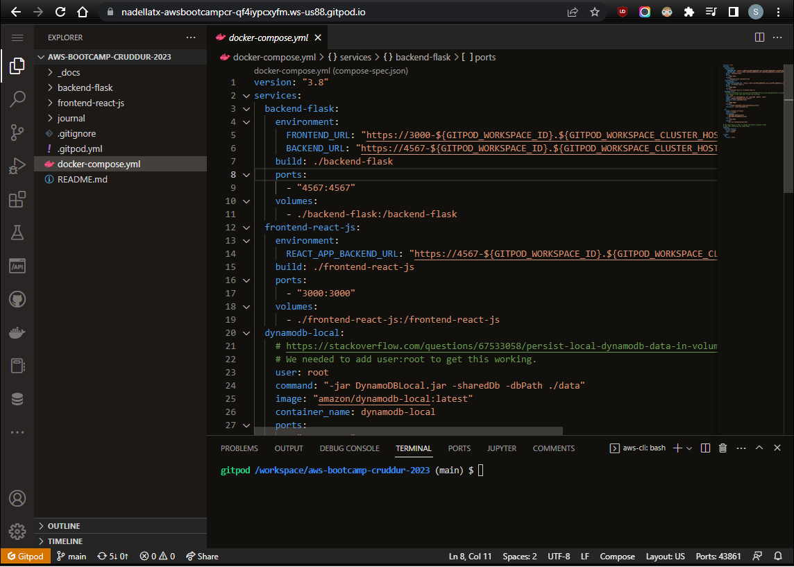
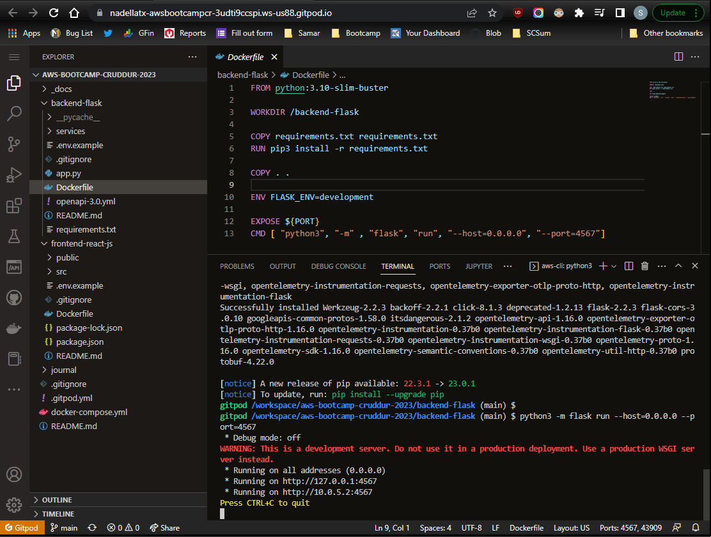
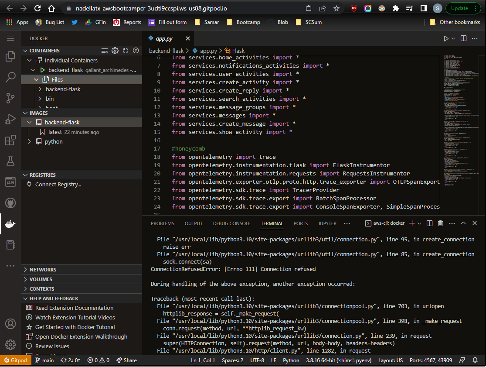
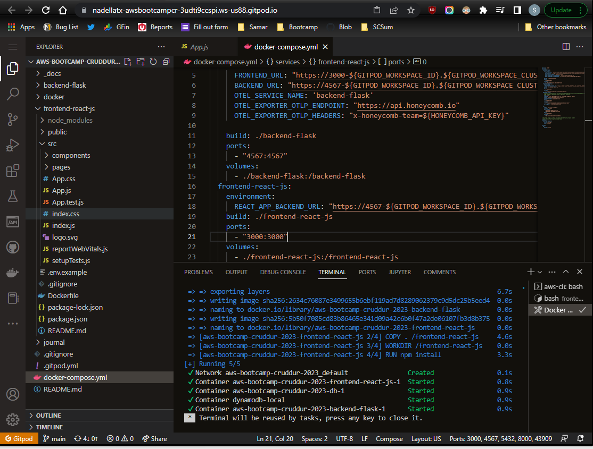

# Week 1 — App Containerization

### 1. Gitpod.yml config

### 2. Built docker images

### 3. Docker compose yml

### 4. App run locally

### 5. Individual container

### 5. Orchestrated container run

