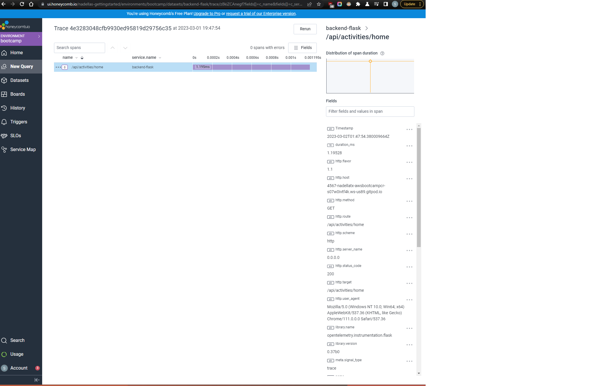
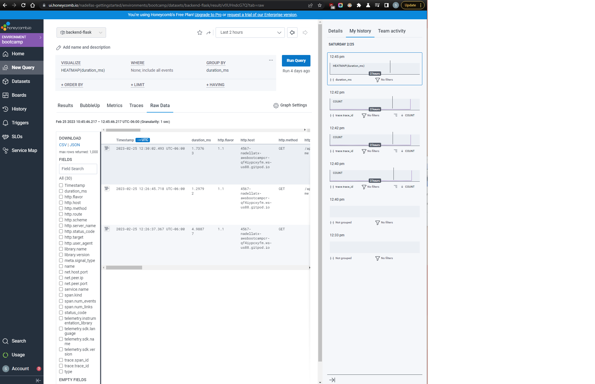
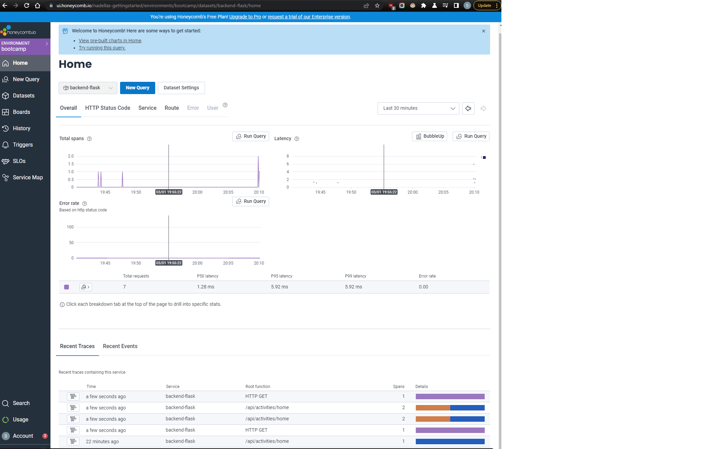
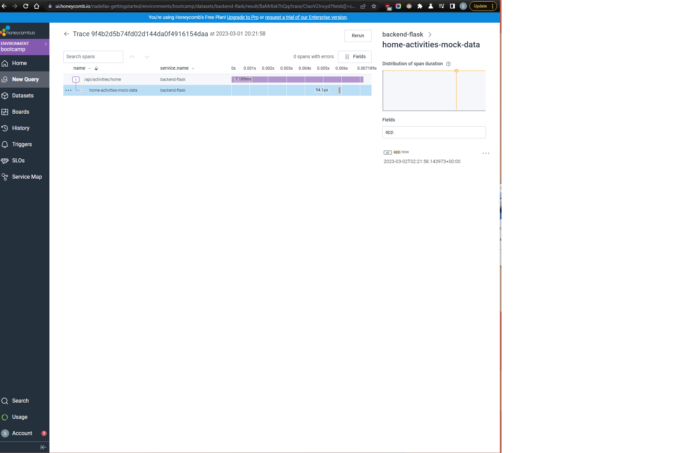
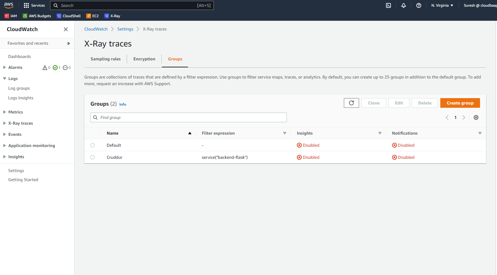
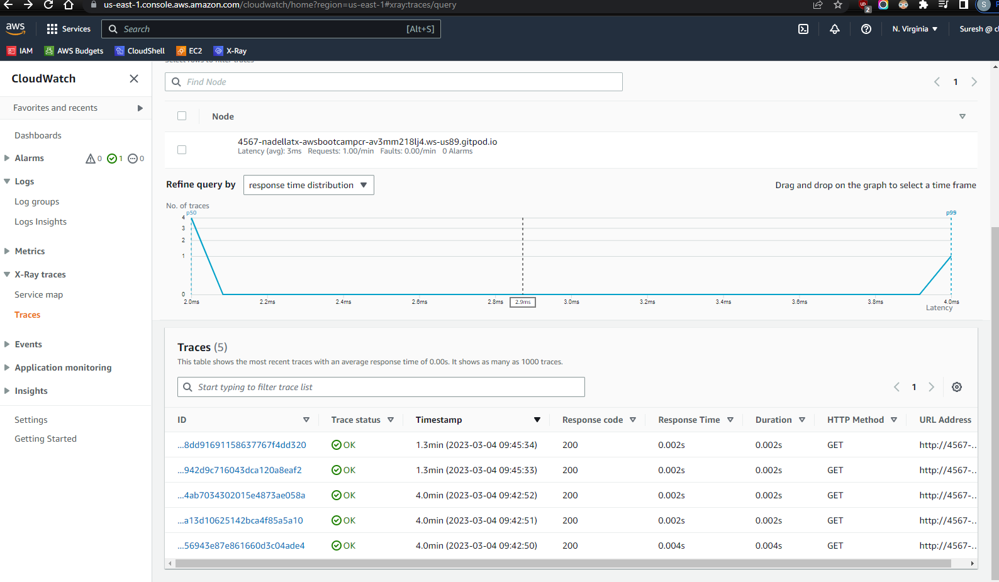
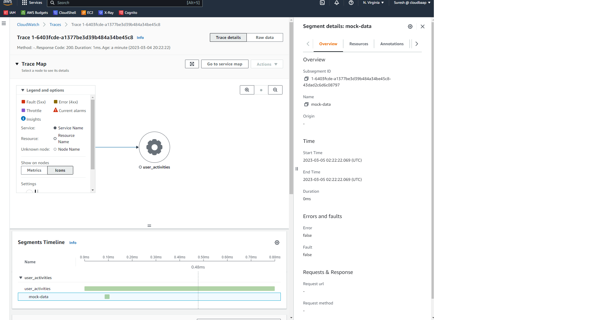
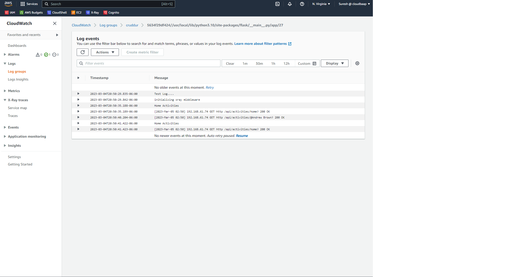
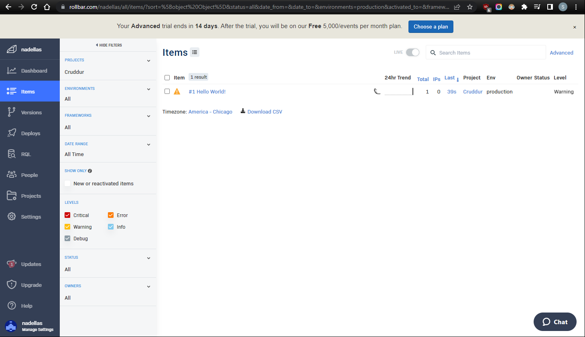

# Week 2 — Distributed Tracing

### 1. Honeycomb Trace 1

### 2. Honeycomb query

### 3. Honeycomb Spans

### 4. Honeycomb span mock data

### 5. Honeycomb attribute

### 6. AWS Xray Groups

### 6. AWS Xray Traces

### 7. AWS Xray Subsegments

### 8. Cloudwatch logs

### 9. Rollbar Item Trace

